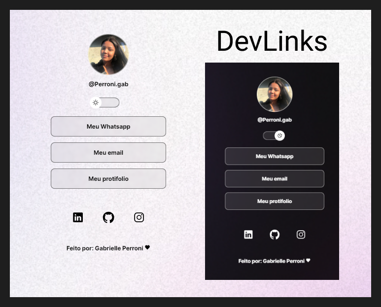

<h1 align="center"> DEV.LINKS </h1>

   programa desenvolvido para apresentar links 

  

[😊⭐⭐Clique aqui para acessar⭐⭐😊](http://127.0.0.1:5500/index.html)

## 🚀Tecnologias
- HTML 
- CSS 
- JAVASCRIPT
- GIT e GITHUB
- FIGMA

## 💻Projeto

O dev.links e um agregador de links para usar como cartao visita online
